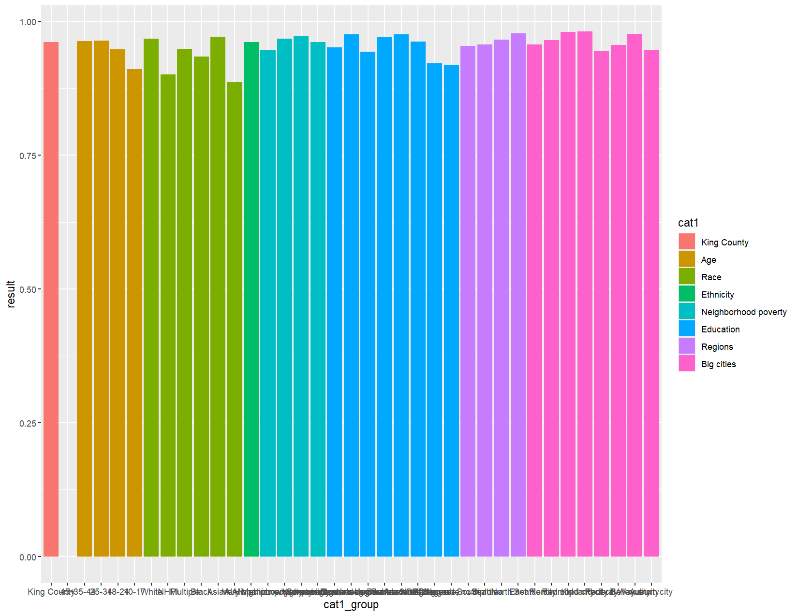
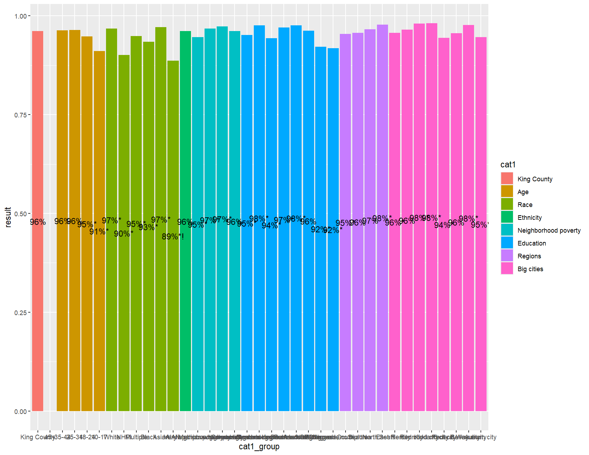
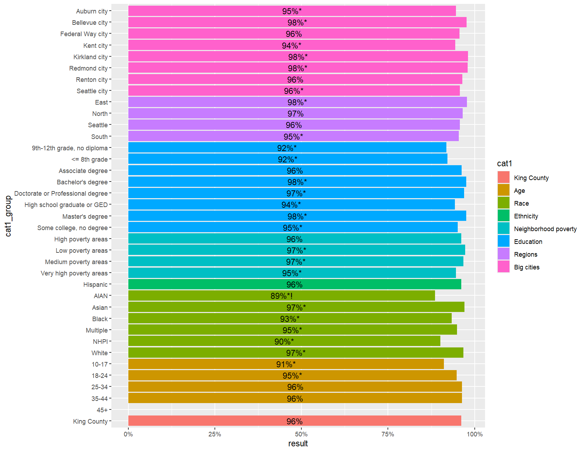
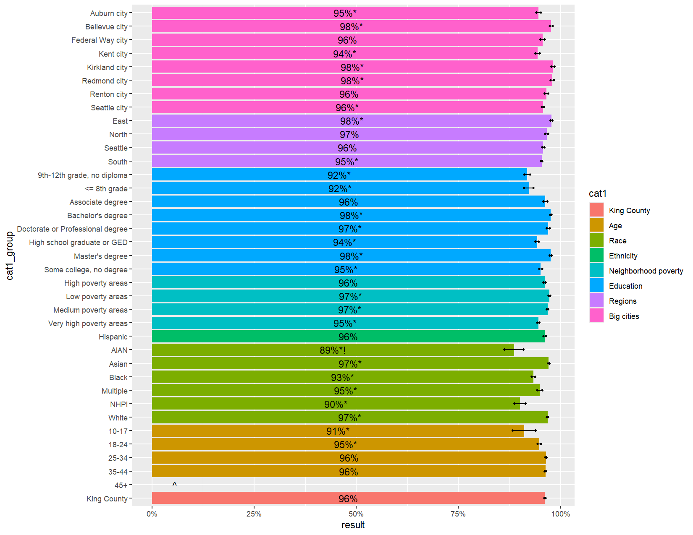
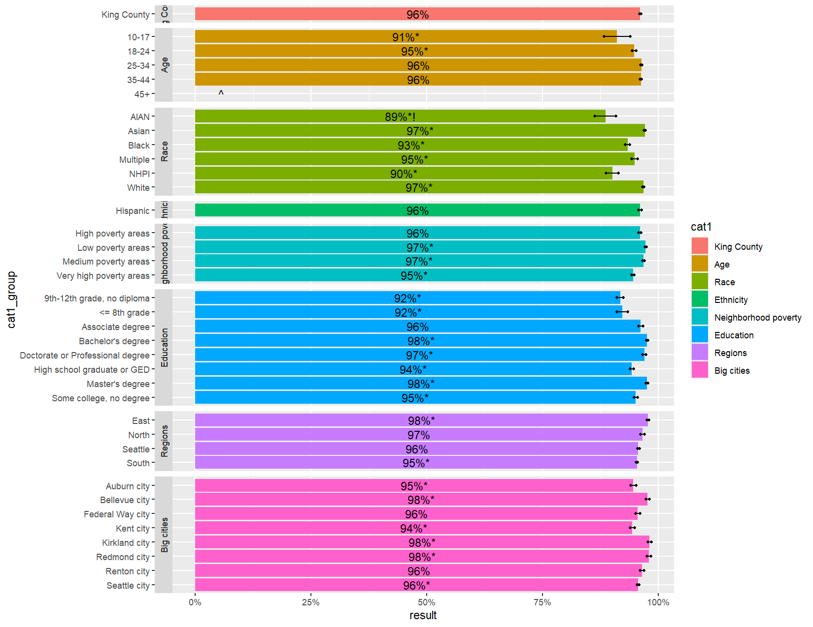
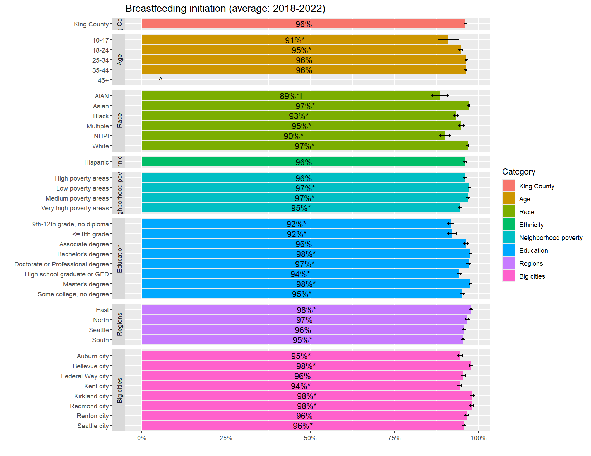
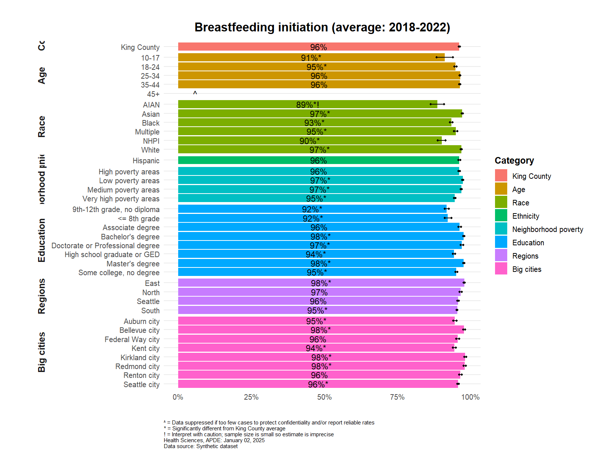
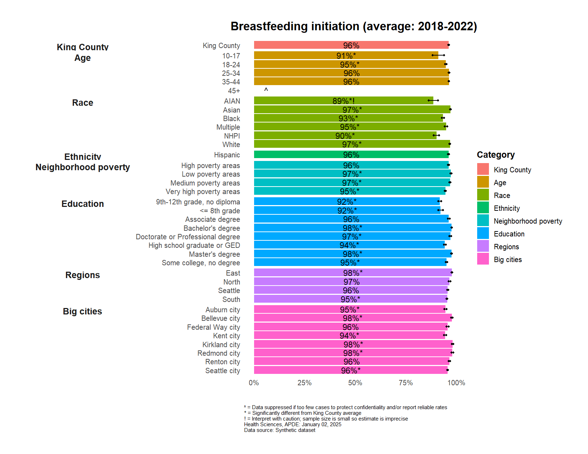
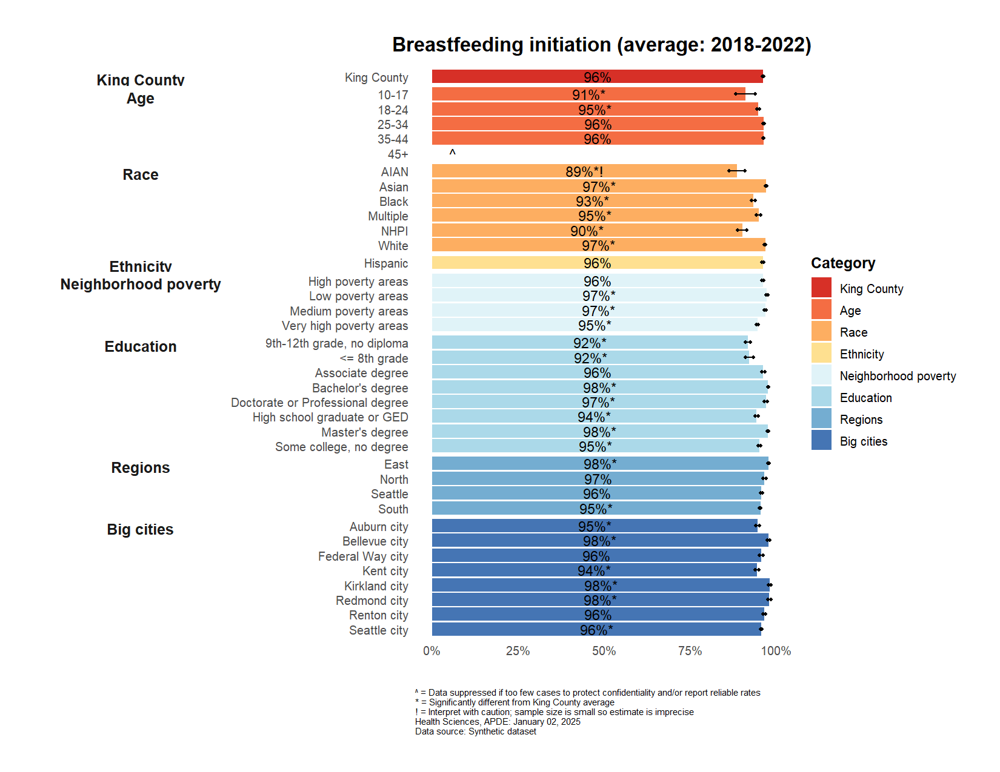
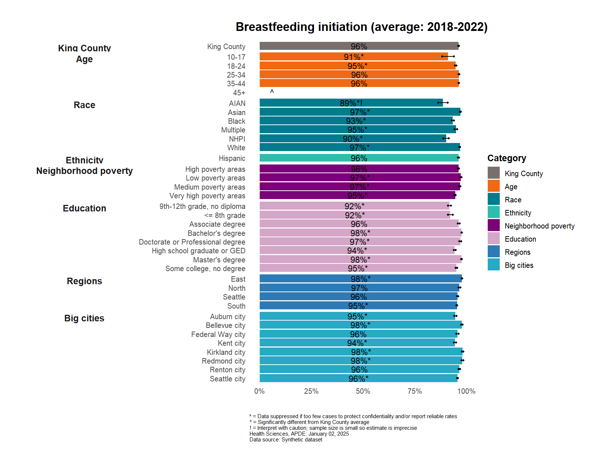

# Horizontal Bar Plot with Groups and Confidence Intervals


This guide demonstrates building a [CHI](https://kingcounty.gov/chi)
style demographics plot with `ggplot2`. Each code section shows how
specific elements contribute to the final visualization. This style is
particularly useful for comparing demographic categories and their
subgroups, with confidence intervals and significance markers.

## Load libraries

The apde.graphs package contains custom functions and themes specific to
APDE visualizations.

``` r
library(ggplot2)
library(data.table)
library(apde.graphs)
library(RColorBrewer)  # Provides color-blind friendly palettes
```

## Import & preview data

The breastfedDT dataset is a synthetic dataset included in the
apde.graphs package for demonstration purposes.

``` r
dt <- apde.graphs::breastfedDT
head(dt)
```

| indicator_key | year | cat1 | cat1_group | cat1_varname | result | lower_bound | upper_bound | significance | caution | suppression |
|:---|:---|:---|:---|:---|---:|---:|---:|:---|:---|:---|
| breastfed | 2018-2022 | King County | King County | chi_geo_kc | 0.961 | 0.960 | 0.963 | NA | NA | NA |
| breastfed | 2018-2022 | Big cities | Auburn city | bigcities | 0.946 | 0.941 | 0.952 | \* | NA | NA |
| breastfed | 2018-2022 | Big cities | Bellevue city | bigcities | 0.977 | 0.974 | 0.981 | \* | NA | NA |
| breastfed | 2018-2022 | Big cities | Federal Way city | bigcities | 0.956 | 0.951 | 0.961 | NA | NA | NA |
| breastfed | 2018-2022 | Big cities | Kent city | bigcities | 0.944 | 0.939 | 0.949 | \* | NA | NA |
| breastfed | 2018-2022 | Big cities | Kirkland city | bigcities | 0.981 | 0.978 | 0.985 | \* | NA | NA |

## Prepare data for plotting

Format percentages, add significance markers, and create ordered factors
for consistent display order.

``` r
# Format percentage for labels
dt[, label := sprintf("%.0f%%", result * 100)]

# Add significance and caution markers to labels
dt[!is.na(significance), label := paste0(label, significance)]
dt[!is.na(caution), label := paste0(label, caution)]

# Create factor levels for ordering - reversed order
dt[, cat1 := factor(cat1, 
                    levels = c("King County", "Age", "Race", "Ethnicity", 
                                   "Neighborhood poverty", "Education", "Regions", 
                                   "Big cities"))]

# Sort data by cat1 and cat1_group
setorder(dt, -cat1, cat1_group)
dt[, cat1_group := factor(cat1_group, levels = rev(unique(cat1_group)))]
```

## Create initial vertical plot

Start with a basic vertical bar plot before flipping coordinates.

``` r
myplot <- ggplot(dt,
               aes(x = cat1_group,
                   y = result,
                   fill = cat1)) +
  geom_bar(stat = "identity")
```



## Add data labels

Position labels in the center of each bar using position_stack().

``` r
myplot <- myplot +
  geom_text(aes(label = label),
            hjust = 0.5,
            position = position_stack(0.5))
```



## Flip coordinates

Convert to horizontal orientation for better readability of category
labels.

``` r
myplot <- myplot +
  coord_flip()
```


## Format x-axis as percentages

The expansion parameter adds extra space on the right for labels to
prevent crowding.

``` r
myplot <- myplot +
  scale_y_continuous(labels = scales::percent)
```



## Add confidence intervals

Add error bars with points at the bounds for better visibility.

``` r
myplot <- myplot +
  geom_point(aes(y = lower_bound), shape = 16, size = 1, show.legend = FALSE) +
  geom_point(aes(y = upper_bound), shape = 16, size = 1, show.legend = FALSE) +
  geom_segment(aes(y = lower_bound, yend = upper_bound,
                  x = cat1_group, xend = cat1_group))
```


## Add suppression markers

Placement of suppression markers at 5% is arbitrary and was chosen to
make it readily visible.

``` r
myplot <- myplot +
  # Add suppression markers with offset
  geom_text(data = dt[!is.na(suppression)],
            aes(y = 0.05, label = suppression),  # Offset to 5% of scale
            hjust = 0)
```



## Add facet labels for categories

Use `facet_grid` to create separate sections for each main category.

``` r
myplot <- myplot +
  facet_grid(cat1 ~ ., # split rows by cat1
             scales = "free_y", # each facet can have different y-axis scale
             space = "free_y",  # facet heights proportional to number of groups
             switch = "y")      # move facet labels to left side 
```



## Set title, axes, and legend labels

Remove axis labels since they’re redundant with the facet labels.

``` r
myplot <- myplot +
  labs(title = "Breastfeeding initiation (average: 2018-2022)",
       x = "", # no x-axis title
       y = "", # no y-axis title
       fill = 'Category' # legend title
  ) 
```



## Default APDE theme and formatting

The `apde_caption()` and `apde_theme()` elements are from the
`apde.graphs` package, not `ggplot2`.

``` r
myplot <- myplot +
  apde_theme() +
  apde_caption(data_source = 'Synthetic dataset', 
               additional_text = 
               c('^ = Data suppressed if too few cases to protect confidentiality and/or report reliable rates\n', 
                 '* = Significantly different from King County average\n', 
                 '! = Interpret with caution; sample size is small so estimate is imprecise\n')
               ) 
```



## Tweak default theme

Adjust category text alignment and remove grid lines for cleaner
appearance.

``` r
myplot <- myplot +
  theme(
    strip.text.y.left = element_text(angle = 0,   # cat1 text inline with cat1_group 
                                     hjust = 0.5, # cat1 centered horizontally 
                                     vjust = 1),  # cat1  alginged at top of each section / panel
    panel.grid.major.y = element_blank() # eliminate horizontal grid lines
  )
```



## ColorBrewer color-blind safe color scheme

RColorBrewer provides color-blind friendly palettes (among many other
palettes).

``` r
myplot_cb <- myplot +
  scale_fill_brewer(palette = "RdYlBu") # a color-blind safe RColorBrewer palette
```



## Custom color scheme

Define specific colors for each category using hex codes or named
colors. These are based on APDE’s [Tableau Style
Guide](https://kc1.sharepoint.com/:w:/r/teams/DPH-TableauResources/_layouts/15/Doc.aspx?sourcedoc=%7B359811A5-92B0-4B13-B6DC-DD71CDBBA11B%7D&file=Tableau%20Style%20Guide%20v1.0.4.docx&action=default&mobileredirect=true)

``` r
myplot_custom <- myplot +
  scale_fill_manual(
    values = c(
      "King County" = "#79706E",
      "Age" = "#F16913",
      "Race" = "#027B8E",
      "Ethnicity" = "#30BCAD",
      "Neighborhood poverty" = "#7A0177",
      "Education" = "#D4A6C8",
      "Regions" = "#2C7BB6",
      "Big cities" = "#28A9C5"
    )
  )
```



## Save the plot

`ggsave` automatically detects file type from filename extension (.jpg,
.png, .pdf, etc.)

``` r
ggsave('health_indicators.jpg',
       myplot_custom,
       width = 11,
       height = 8.5,
       dpi = 600, 
       units = 'in')
```
