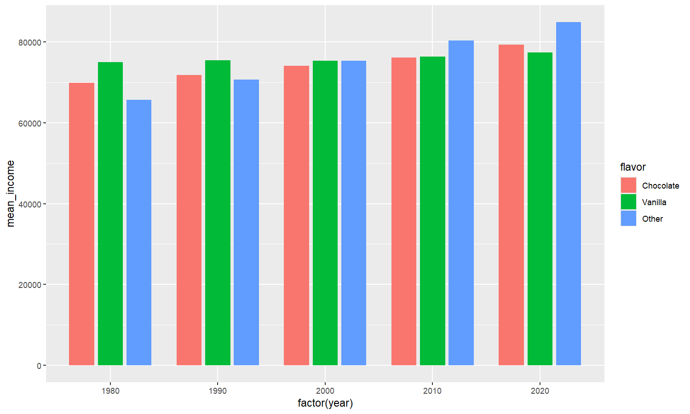
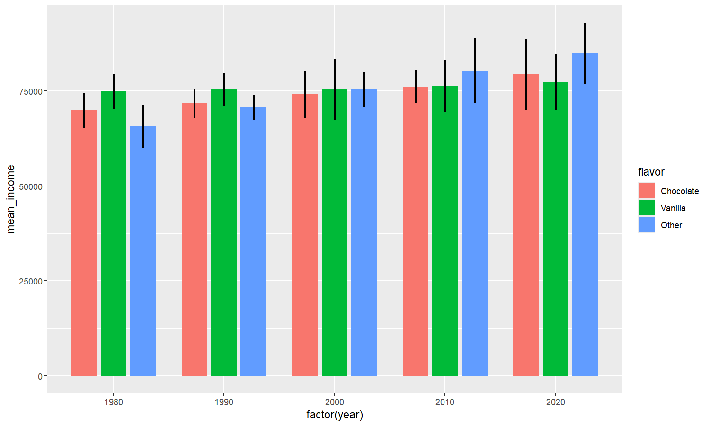
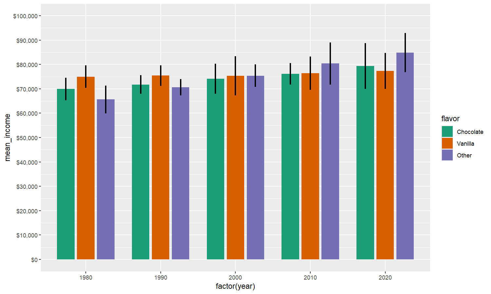
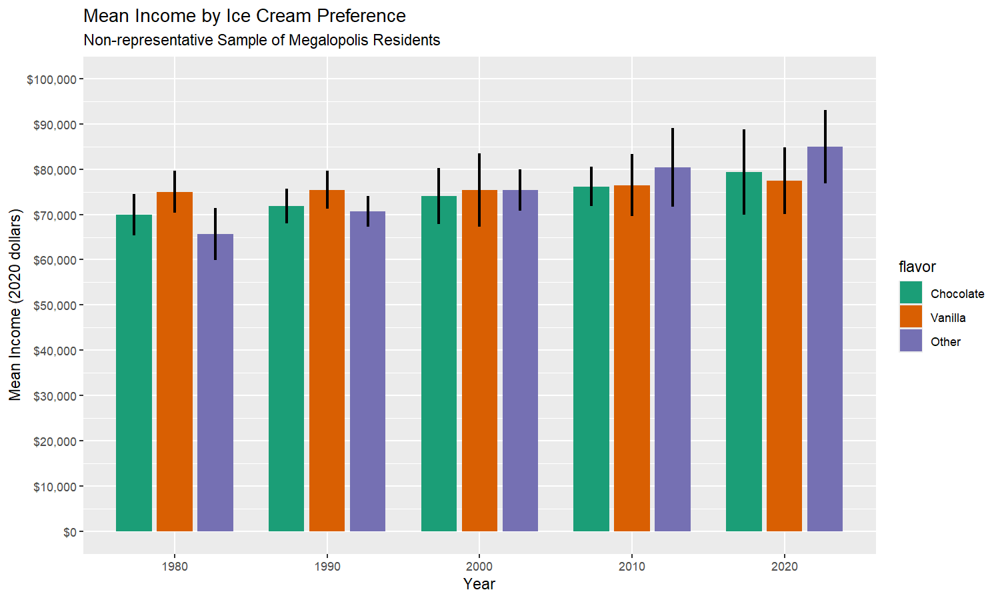
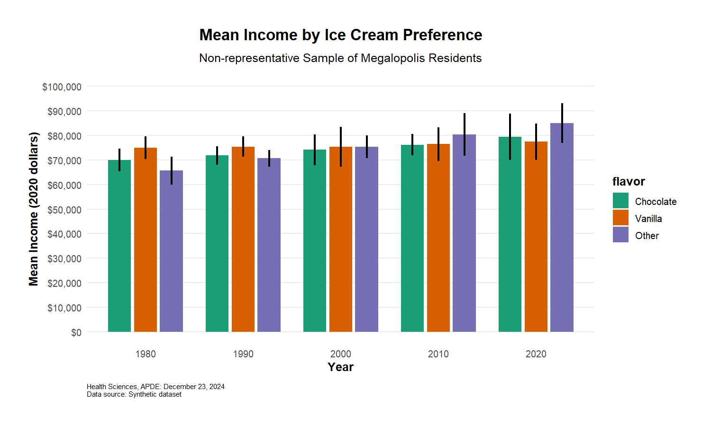
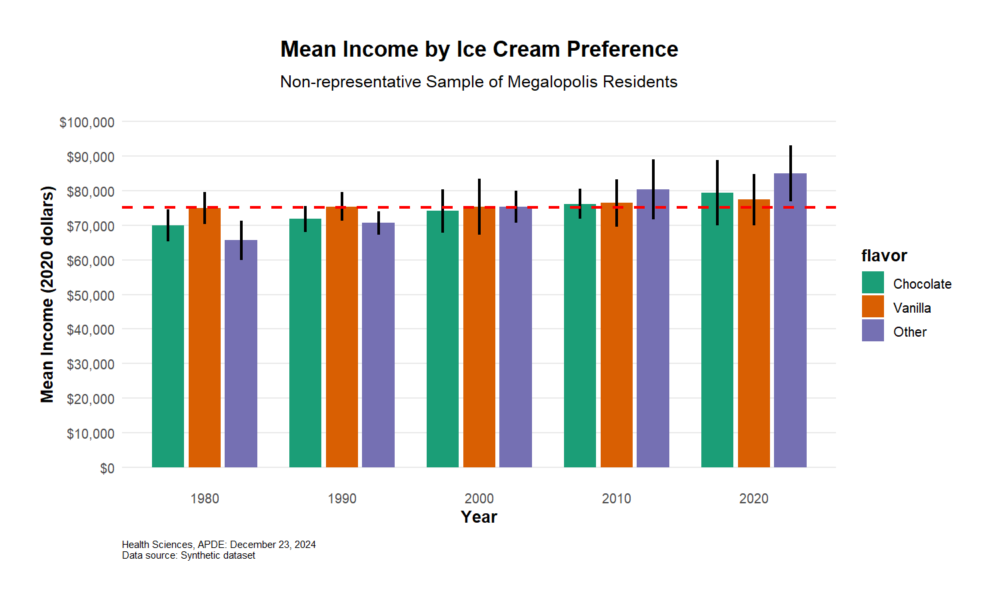
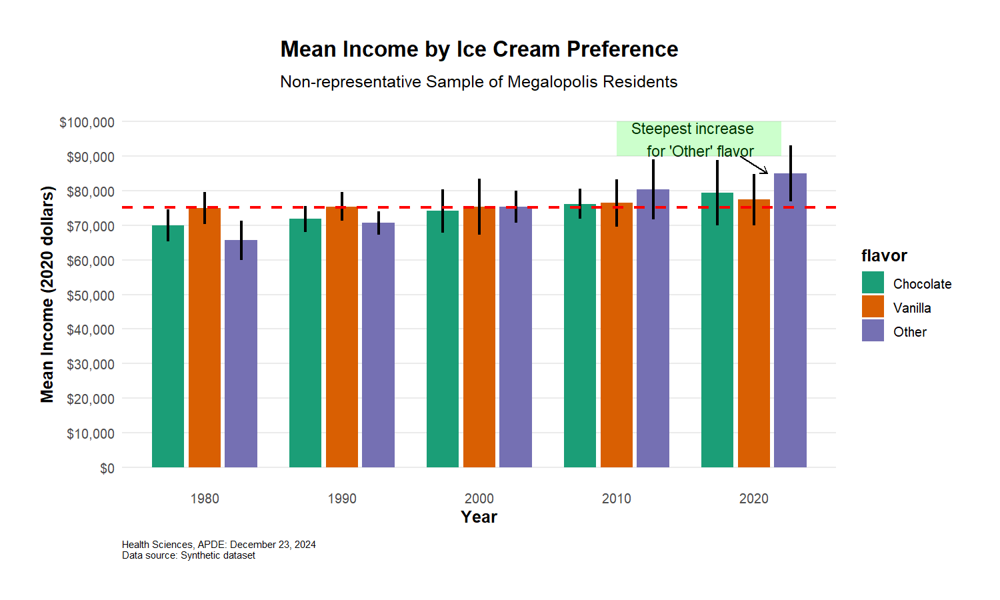

# Bar Plots with Multiple Groups and Error Bars


This example demonstrates `ggplot2` code by building a bar plot
step-by-step. While you would typically write all components in a single
code block using `+` to connect elements, breaking it down helps
illustrate how each piece contributes to the final visualization.

## Load libraries

``` r
library(ggplot2)
library(apde.graphs)
library(data.table)
library(scales) # to label axes with $, %, etc. 
```

## Import & preview synthetic data

``` r
dt <- apde.graphs::icecreamDT
head(dt)
```

| year | flavor    | mean_income |   se |
|-----:|:----------|------------:|-----:|
| 1980 | Chocolate |       69931 | 2342 |
| 1980 | Other     |       65656 | 2909 |
| 1980 | Vanilla   |       74969 | 2360 |
| 1990 | Chocolate |       71791 | 1954 |
| 1990 | Other     |       70697 | 1708 |
| 1990 | Vanilla   |       75432 | 2148 |

## Create the base `ggplot2` bar plot

``` r
ice_cream_plot <- ggplot(dt, aes(x = factor(year), 
                                 y = mean_income,
                                 fill = flavor)) +  # different color for each flavor
  # Basic bar plot
  geom_col(position = position_dodge(width = 0.8),  # adjust horizontally to show groups
           width = 0.7)                             # adjust bar width
```



## Add error bars to show uncertainty (95% confidence intervals)

``` r
ice_cream_plot <- ice_cream_plot + 
  geom_errorbar(aes(ymin = mean_income - 1.96*se,   # lower bound CI
                    ymax = mean_income + 1.96*se),  # upper bound CI
                position = position_dodge(width = 0.8), # adjust horizontally to align with bars
                linewidth = 1, # width of the error bar
                width = 0)     # width of the horizontal lines at the ends of the bar
```



## Add colors and scales

``` r
ice_cream_plot <- ice_cream_plot +
  # Custom colors using colorbrewer
  scale_fill_brewer(palette = "Dark2") +  # One of many colorblind-friendly palettes

  # Customize y-axis with dollar signs
  scale_y_continuous(
    limits = c(0, 100000),           # fix y-axis range
    breaks = seq(0, 100000, 10000),  # show tick marks every $10,000
    labels = scales::label_currency(prefix = '$')
  )
```



## Add labels

``` r
ice_cream_plot <- ice_cream_plot +
  labs(
    title = 'Mean Income by Ice Cream Preference',
    subtitle = 'Non-representative Sample of Megalopolis Residents',
    x = 'Year',
    y = 'Mean Income (2020 dollars)'
  )
```



## Add APDE customizations

The `apde_caption()` and `theme_apde()` elements are from the
`apde.graphs` package, not `ggplot2`.

``` r
ice_cream_plot <- ice_cream_plot +
  
  apde_caption(data_source = 'Synthetic dataset') +
  
  theme_apde()
```



## Add horizontal reference line

``` r
ice_cream_plot <- ice_cream_plot +
  # Add reference line at overall mean
  geom_hline(yintercept = mean(dt$mean_income),
             linetype = 'dashed', # also 'solid', 'dashed', 'dotdash', 'longdash', and 'twodash'
             linewidth = 1,
             color = 'red') 
```



## Add annotations

``` r
ice_cream_plot <- ice_cream_plot +
  # Add explanatory text
  annotate(
    geom = 'text',
    x = 5,
    y = 95000,
    label = "Steepest increase\nfor 'Other' flavor",
    hjust = 1  # horizontal justification
  ) + 
  
  # Add arrow pointing to steepest increase
  annotate(
    geom = "segment",
    x = 4.9, xend = 5.1,
    y = 90000, yend = 85000,
    arrow = arrow(length = unit(0.2, "cm"))
  ) +
  
  # Add a shaded box around the text
  annotate(
    geom = 'rect',        # highlight an area of your graph
    xmin = 4, xmax = 5.2, 
    ymin = 90000, ymax = 100000,
    alpha = 0.2,          # transparency (0 == most, 1 == least)
    fill = 'green',       # color of box 
    col = NA)             # color of box outline
```



## Save the plot

`ggsave` automatically detects file type from filename extension (.jpg,
.png, .pdf, etc.)

``` r
ggsave(filename = 'income_by_ice_cream_preference.jpg', # filename with extension
       plot = ice_cream_plot,                           # plot to save
       width = 10,                                      # width in inches
       height = 6,                                      # height in inches
       dpi = 600)                                       # resolution in dots per inch
```

– *Updated by dcolombara, 2024-12-23*
