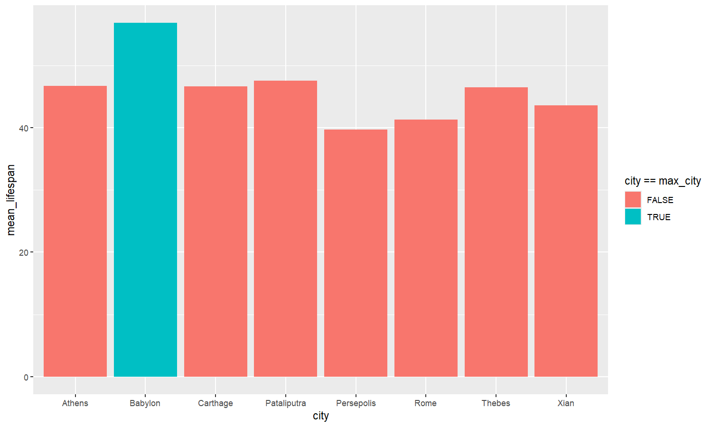
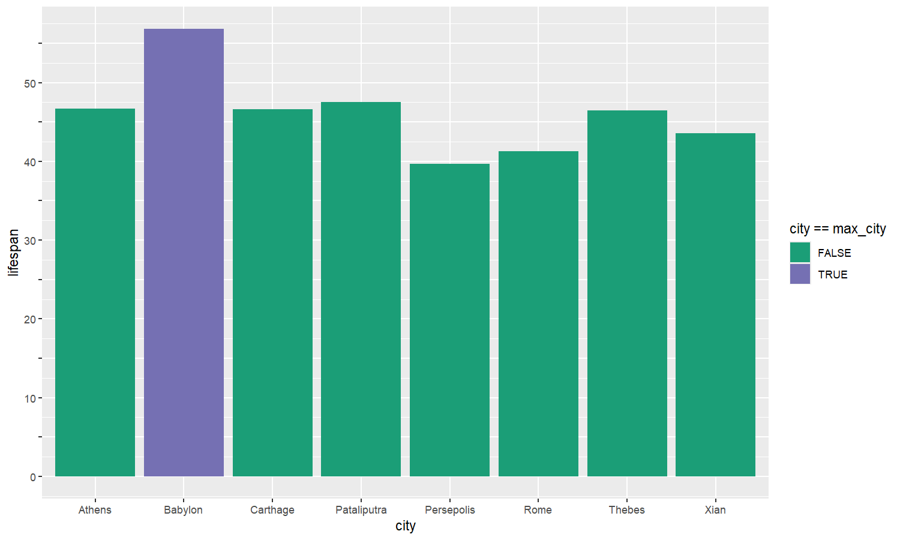
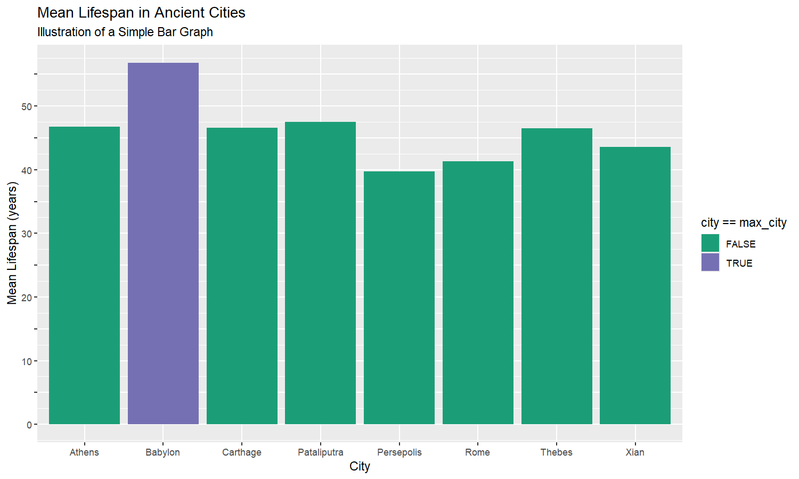
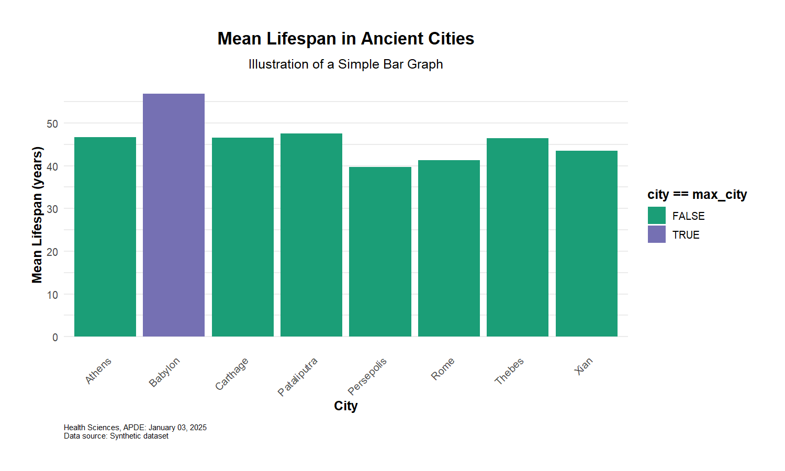
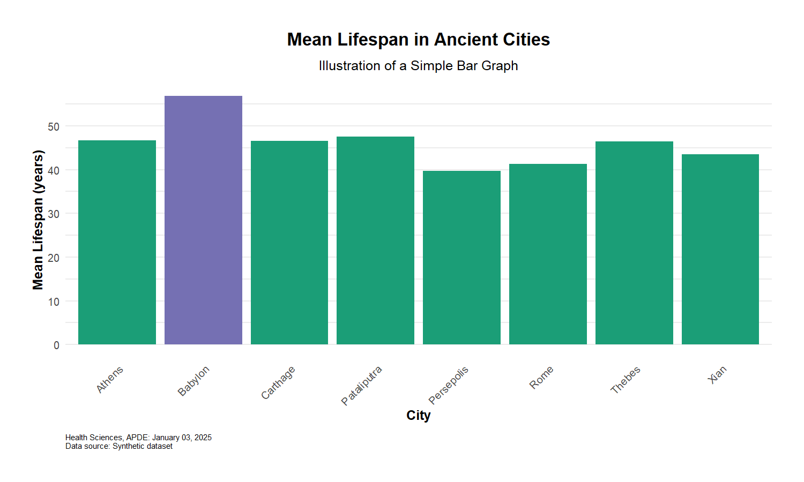
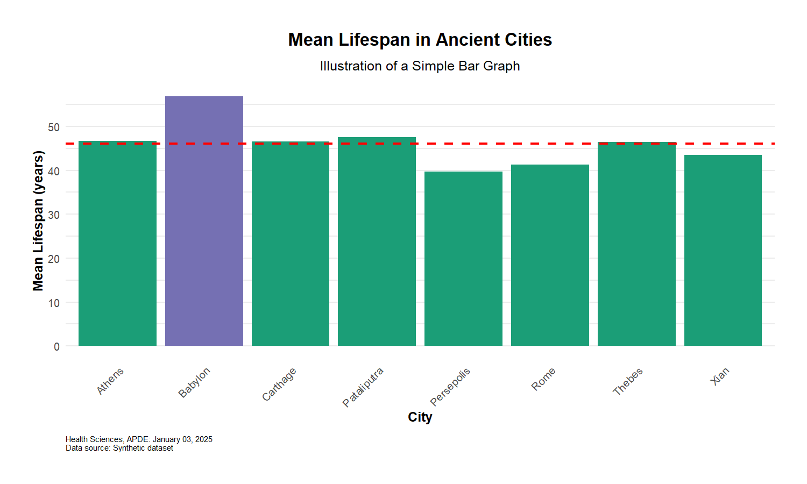
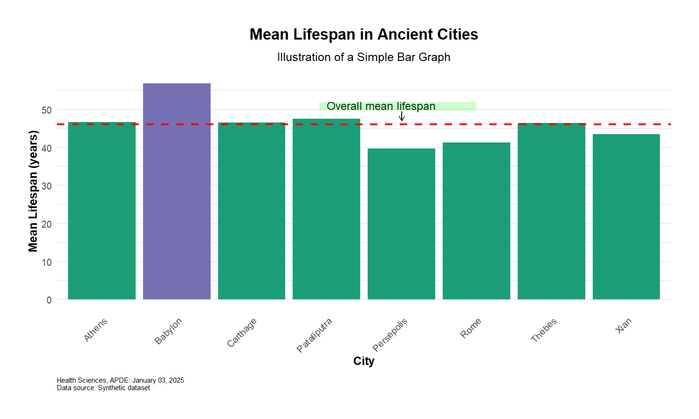
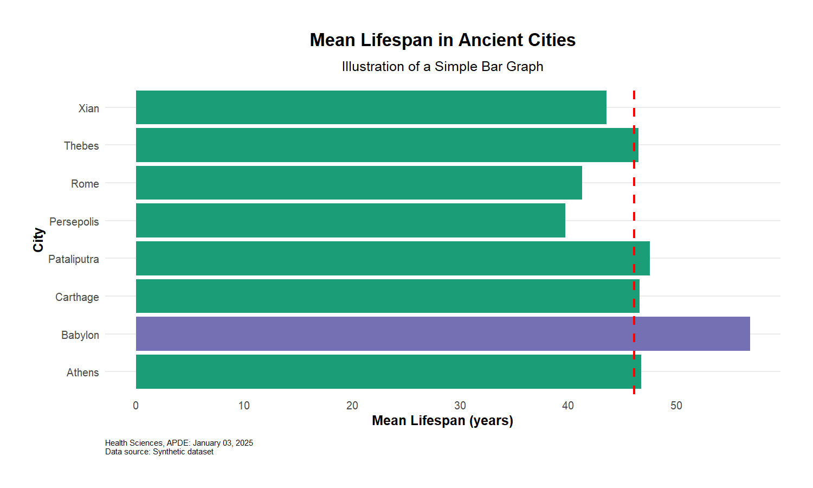
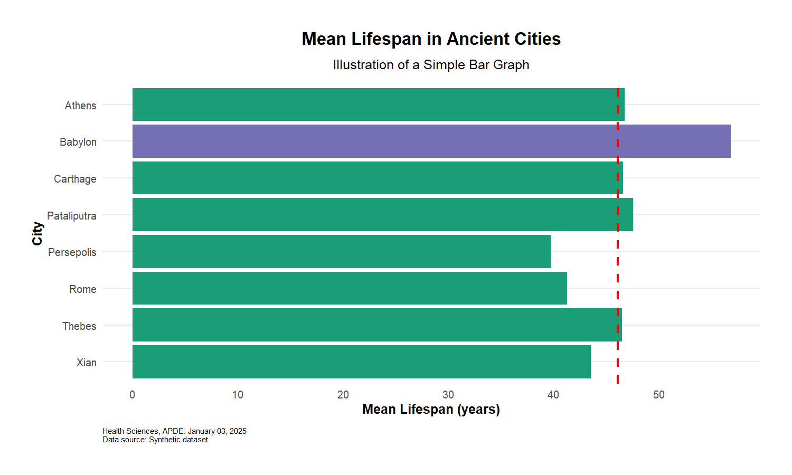

# Bar Plots with Highlighted Bars


This is a step-by-step guide to building bar plots with both
***line-level*** and ***pre-aggregated*** data. While you would
typically write all components in a single code block using `+` to
connect elements, we hope splitting the code will illustrate how each
snippet contributes to the final visualization.

## Load libraries

``` r
library(ggplot2)
library(data.table)
library(apde.graphs)
```

## Import & preview synthetic data

### Pre-aggregated data

``` r
dt_agg <- apde.graphs::lifespanDT_agg
head(dt_agg)
```

| city        | mean_lifespan |
|:------------|--------------:|
| Athens      |        46.722 |
| Babylon     |        56.812 |
| Carthage    |        46.605 |
| Pataliputra |        47.526 |
| Persepolis  |        39.719 |
| Rome        |        41.302 |

### Line-level data

``` r
dt_raw <- apde.graphs::lifespanDT_raw
max_city <- dt_raw[, .(mean_lifespan = mean(lifespan)), by = city][which.max(mean_lifespan), city]
head(dt_raw)
```

| city   | lifespan |
|:-------|---------:|
| Athens |       51 |
| Athens |       46 |
| Athens |       45 |
| Athens |       48 |
| Athens |       49 |
| Athens |       61 |

## Create the base `ggplot2` bar plots

### Pre-aggregated data (use *`stat = 'identity'`*)

``` r
plot_agg <- ggplot(dt_agg, aes(x = city, 
                               y = mean_lifespan,
                               fill = city == max_city)) +  # Use logical test to determine fill color
  
  # Basic bar plot for pre-calculated means
  geom_bar(stat = "identity") # geom_col() would be equivalent
```



### Line-level data (use *`stat = 'summary'`*)

``` r
plot_raw <- ggplot(dt_raw, aes(x = city, 
                               y = lifespan,
                               fill = city == max_city)) +  # Use logical test to determine fill color
  
  # Basic bar plot that calculates means from raw data
  geom_bar(stat = "summary",  # stat = "summary" performs calculation from raw observations
           fun = "mean")      # fun = "mean" specifies we want the mean of all observations per city
```


***Note!** when you have `geom_bar(stat = 'summary', fun = ...)`,
`fun =` can take the following built-in options: “mean”, “median”,
“sum”, “min”, “max”, “length”, “sd”, “var”, and “IQR”. Custom functions
can also be used.*

At this point the two plots are (more or less) the same and the
remaining code can be applied to either plot. For simplicity, we have
arbitrarily chosen to continue with the `plot_raw` object.

## Define scales (axes and colors)

``` r
plot_raw <- plot_raw + 
    # Custom colors: can use names ('black') or hex ('#000000')
    scale_fill_manual(values = c('TRUE' = '#7570B3',     # hex color for highest value
                                'FALSE' = '#1B9E77')) +  # hex color for other values
    
    # Customize y-axis
    scale_y_continuous(
      breaks = seq(0, 60, by = 5),    # show tick marks every 5 units
      labels = function(x) ifelse(x %% 10 == 0, x, "")  # only show axis labels for multiples of 10
    )
```



## Add labels

``` r
plot_raw <- plot_raw +
    labs(
      title = 'Mean Lifespan in Ancient Cities',
      subtitle = 'Illustration of a Simple Bar Graph',
      x = 'City',
      y = 'Mean Lifespan (years)'
    )
```



## Add APDE customizations

The `apde_caption()`, `apde_theme()`, and `apde_rotate_xlab()` elements
are from the `apde.graphs` package, not `ggplot2`.

``` r
plot_raw <- plot_raw +
    apde_caption(data_source = 'Synthetic dataset') +
    apde_theme() +
    apde_rotate_xlab() # pivots x-axis labels by 45 degrees to reduce crowding
```



## Drop legend since it is not useful in this graph

``` r
plot_raw <- plot_raw + 
  theme(legend.position = 'none')
```



## Add horizontal reference line

``` r
plot_raw <- plot_raw +
    geom_hline(yintercept = mean(dt_raw$lifespan), 
               linetype = 'dashed',  # also 'solid', 'dashed', 'dotdash', 'longdash', and 'twodash'
               linewidth = 1,
               color = 'red')
```



## Add annotations

``` r
plot_annotated <- plot_raw +
  
    # Add text annotation
    annotate(
      geom = 'text',
      size = 4,
      x = 4,  # when categorical, each category = 1 increment 
      y = 50,
      label = 'Overall mean lifespan',
      hjust = 0,  # horizontal justification
      vjust = 0   # vertical justification
    ) +
    
    # Add arrow
    annotate(
      geom = "segment",
      x = 5, xend = 5,
      y = 49.5, yend = 47,
      arrow = arrow(length = unit(0.2, "cm"))
    ) +
    
    # Add highlighted rectangle
    annotate(
      geom = 'rect',
      xmin = 3.9, xmax = 6,
      ymin = 49.7, ymax = 52,
      alpha = 0.2,    # transparency (0 == most, 1 == least)
      fill = 'green', # color of rectangle
      col = NA        # color of outline, NA == no outline
    )
```

## Display the annotated plot



## Create horizontal (rotated) version

``` r
plot_horizontal <- plot_raw + 
  coord_flip() + # rotates the entire plot
  apde_rotate_xlab(angle = 0,   # rotated x axis labels not needed for horizontal version
                  hjust = 0.5) # horizontal justification
```



Notice that the y-axis is now in reverse alphabetical order. To reverse
this order, you will have to reverse the order of the `city` factor
variable.

``` r
# Create the order we want
city_order <- sort(unique(plot_raw$data$city), decreasing = TRUE)

# Plot
plot_horizontal <- plot_raw + 
  scale_x_discrete(limits = city_order) +
  coord_flip() + # rotates the entire plot
  apde_rotate_xlab(angle = 0,    # rotated x axis labels not needed for horizontal version
                  hjust = 0.5)  # horizontal justification
```



## Save the plots

`ggsave` automatically detects file type from filename extension (.jpg,
.png, .pdf, etc.)

``` r
# Save the annotated vertical version
ggsave('ancient_cities_annotated.jpg',    
       plot_annotated,                   
       width = 10,                           
       height = 6,                           
       dpi = 600)                            

# Save the horizontal versions
ggsave('ancient_cities_horizontal.jpg', 
       plot_horizontal, 
       width = 10, 
       height = 6, 
       dpi = 600)
```

– *Updated by dcolombara, 2025-01-03*
