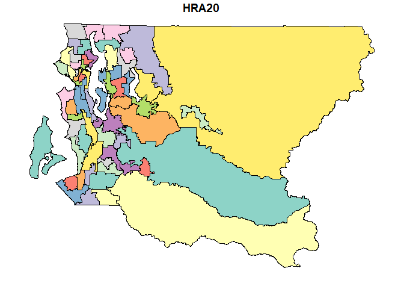
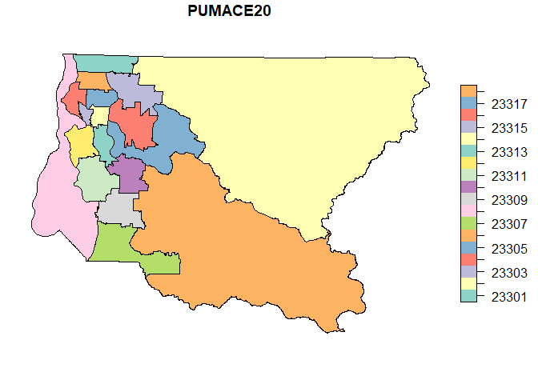
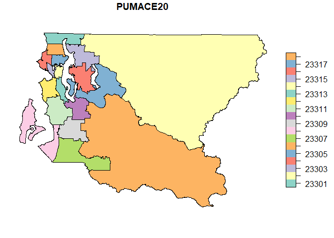
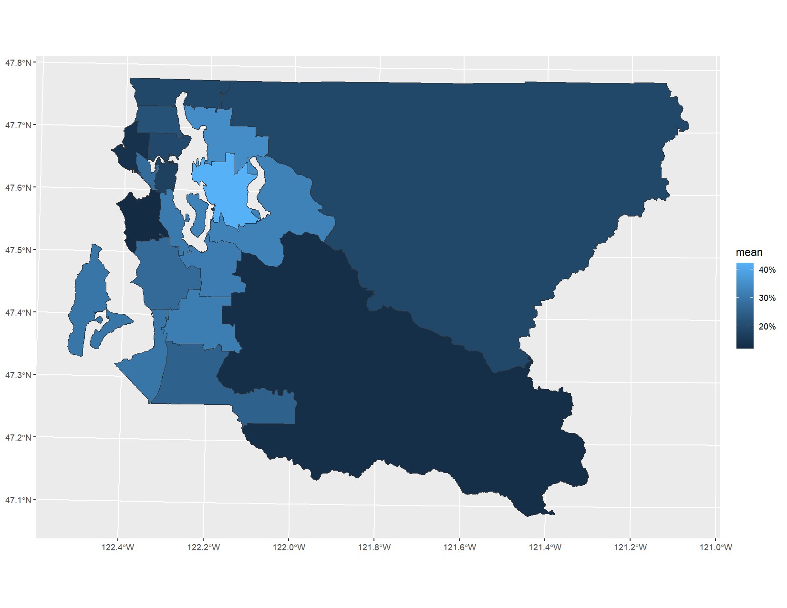
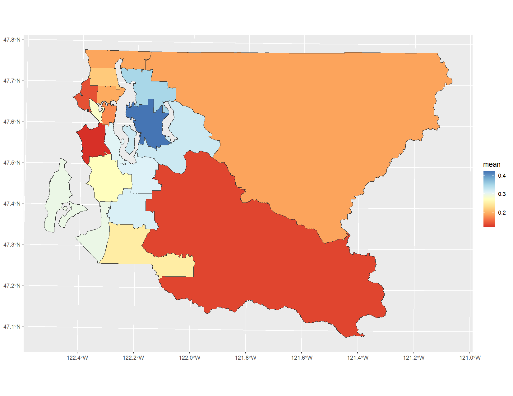
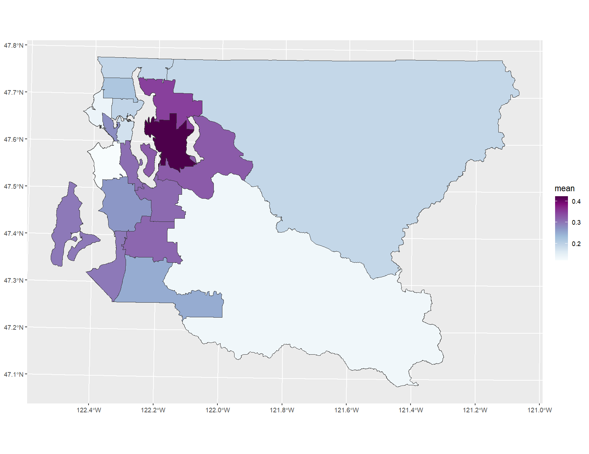
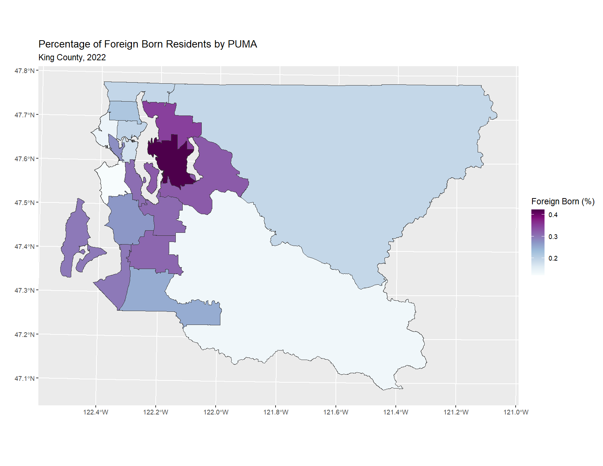
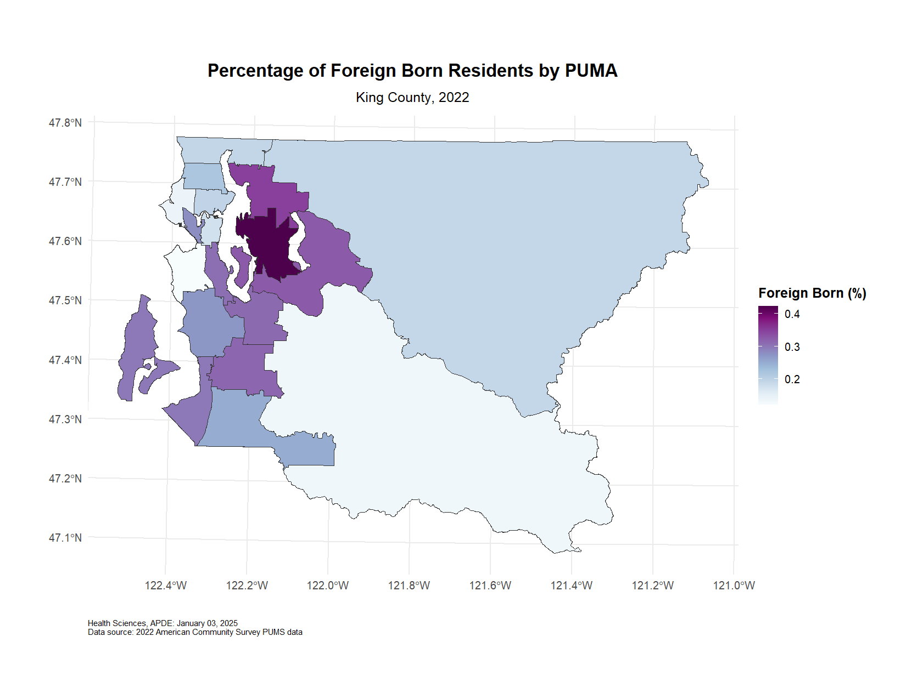
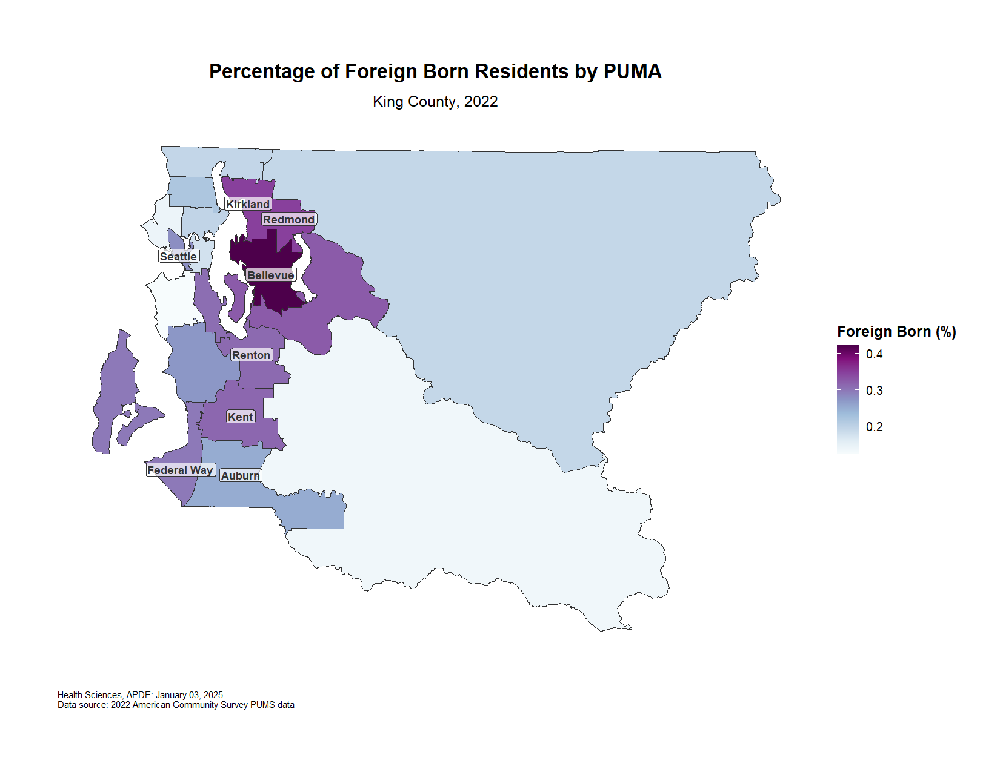

# Chloropleth Maps


This is a step-by-step guide to building a chloropleth map using
`ggplot2`. While you would typically write all components in a single
code block using `+` to connect elements, we hope splitting the code
will illustrate how each snippet contributes to the final visualization.

***Note!*** [`tmap`](https://r-tmap.github.io/tmap/) is sometimes used
for static maps, but we demonstrate `ggplot2` for consistency with the
other guides in this package. If you are interested in creating dynamic
maps, we suggest starting with
[`mapview`](https://r-spatial.github.io/mapview/).

## Load libraries

``` r
library(ggplot2)
library(apde.graphs)
library(sf)
```

## Import & preview data

### 2022 ACS PUMS Estimates of Foreign Born Residents of King County - by PUMAs

``` r
foreignborn <- apde.graphs::foreignbornDT
head(foreignborn)
```

| year | PUMACE20 | variable     |      mean |
|-----:|---------:|:-------------|----------:|
| 2022 |    23301 | Foreign Born | 0.1925276 |
| 2022 |    23302 | Foreign Born | 0.1910443 |
| 2022 |    23303 | Foreign Born | 0.3485104 |
| 2022 |    23304 | Foreign Born | 0.4222612 |
| 2022 |    23305 | Foreign Born | 0.3242605 |
| 2022 |    23306 | Foreign Born | 0.1334092 |

### Health Reporting Area (HRA)

``` r
hras <- apde.graphs::shapeHRA20
plot(hras)
```



### Public Use Microdata Areas (PUMAs)

``` r
pumas <- apde.graphs::shapePUMA20
plot(pumas)
```



## Tidy the PUMA shapefile

Both maps look reasonable, but the PUMA map fills in areas that should
be water in King County. We can fix this by using the HRA map’s more
accurate boundaries.

### Ensure that the PUMA and HRA shapefiles have the same coordinate reference system (CRS)

``` r
if(!identical(st_crs(pumas), st_crs(hras))) puma <- st_transform(pumas, st_crs(hra))
```

### Remove water from the PUMAs using information from the HRAs

``` r
pumas = st_intersection(pumas, st_union(hras))
plot(pumas)
```



## Merge your estimates onto the shapefile

``` r
pumas <- merge(pumas, foreignborn, by = 'PUMACE20', all = T)
head(pumas)
```

| PUMACE20 | year | variable     |      mean | geometry                     |
|:---------|-----:|:-------------|----------:|:-----------------------------|
| 23301    | 2022 | Foreign Born | 0.1925276 | MULTIPOLYGON (((1279348 287… |
| 23302    | 2022 | Foreign Born | 0.1910443 | POLYGON ((1529118 189527.8,… |
| 23303    | 2022 | Foreign Born | 0.3485104 | MULTIPOLYGON (((1331413 242… |
| 23304    | 2022 | Foreign Born | 0.4222612 | MULTIPOLYGON (((1312313 238… |
| 23305    | 2022 | Foreign Born | 0.3242605 | MULTIPOLYGON (((1363106 225… |
| 23306    | 2022 | Foreign Born | 0.1334092 | POLYGON ((1325466 85850.95,… |

## Create initial map

Start with a basic map using default colors.

``` r
mymap <- ggplot(data = pumas) +
  geom_sf(aes(fill = mean), 
          color = '#333333') # hex code is from Tableau Style Guide 
```


## Format legend as percentages

Convert the legend values to percentages and adjust breaks for
readability.

``` r
mymap <- mymap +
  scale_fill_continuous(labels = scales::percent_format(accuracy = 1),
                       breaks = seq(0, 1, by = 0.1))
```



## Add APDE’s diverging color scheme

While not appropriate for this neutral indicator, here is the [Tableau
Style
Guide’s](https://kc1.sharepoint.com/:w:/r/teams/DPH-TableauResources/_layouts/15/Doc.aspx?sourcedoc=%7B359811A5-92B0-4B13-B6DC-DD71CDBBA11B%7D&file=Tableau%20Style%20Guide%20v1.0.4.docx&action=default&mobileredirect=true)
recommended diverging color scheme for reference.

``` r
mymap_diverging <- mymap +
  scale_fill_gradientn(
    colors = c("#d73027", "#f46d43", "#fdae61", "#fee090", "#ffffbf",
               "#e0f3f8", "#abd9e9", "#74add1", "#4575b4")
  )
```



## Add APDE’s neutral color scheme

Since foreign-born population is a neutral indicator, we use the
[Tableau Style
Guide’s](https://kc1.sharepoint.com/:w:/r/teams/DPH-TableauResources/_layouts/15/Doc.aspx?sourcedoc=%7B359811A5-92B0-4B13-B6DC-DD71CDBBA11B%7D&file=Tableau%20Style%20Guide%20v1.0.4.docx&action=default&mobileredirect=true)
sequential color scheme.

``` r
mymap <- mymap +
  scale_fill_gradientn(
    colors = c("#f7fcfd", "#e0ecf4", "#bfd3e6", "#9ebcda", "#8c96c6",
               "#8c6bb1", "#88419d", "#810f7c", "#4d004b")
  )
```



## Add titles and format legend

``` r
mymap <- mymap +
  labs(title = "Percentage of Foreign Born Residents by PUMA",
       subtitle = "King County, 2022",
       x = "", # no x-axis title
       y = "", # no y-axis title
       fill = "Foreign Born (%)") # legend title
```



## Add APDE theme and caption

``` r
mymap <- mymap +
  apde_theme() +
  apde_caption(data_source = "2022 American Community Survey PUMS data")
```



## Tweak default theme

Remove grid lines and adjust margins for a cleaner map display.

``` r
mymap <- mymap +
  theme(
    panel.grid = element_blank(),
    axis.text = element_blank(),
    plot.margin = margin(1, 1, 1, 1, "cm")
  )
```


## Add ‘Big City’ labels

Add city names to their centroids to help orient map users.

``` r
# Import centroids for 'Big Cities'
centroids <- apde.graphs::centroidsBigCities

# Add city labels to map
mymap <- mymap +
    geom_sf_label(data = centroids,
                aes(label = NAME),
                size = 3,
                fontface = "bold",
                color = "#333333",
                fill = "white", # background color
                alpha = 0.7,    # transparency for the background
                label.padding = unit(0.15, "lines"))  # Padding around text
```



## Save the plot

``` r
ggsave('foreign_born_map.jpg',
       mymap,
       width = 11,
       height = 8.5,
       dpi = 600,
       units = 'in')
```
