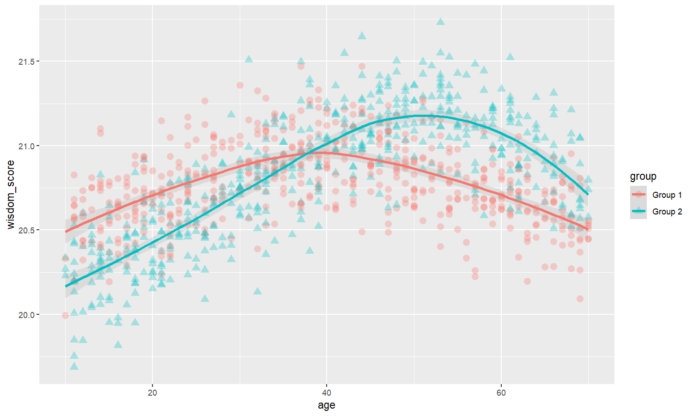
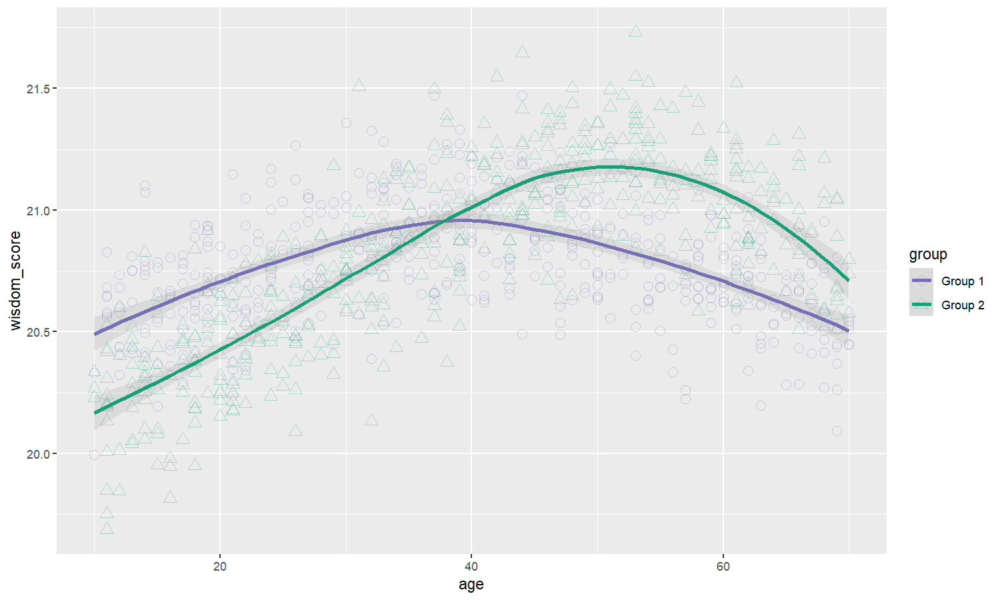
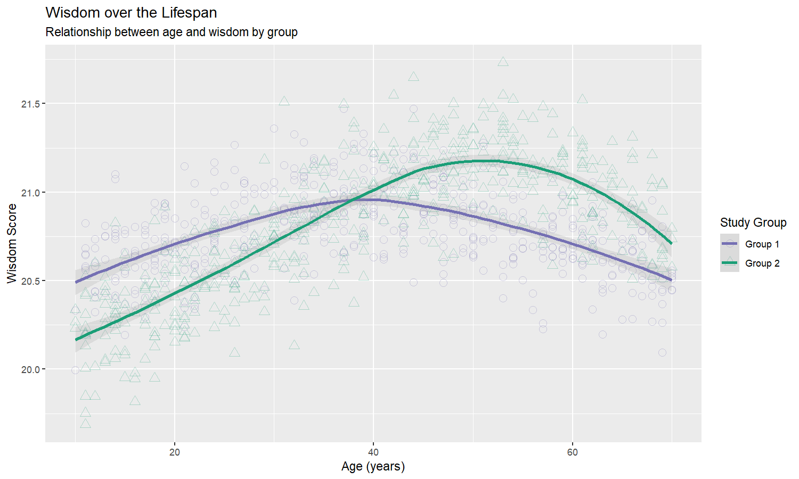
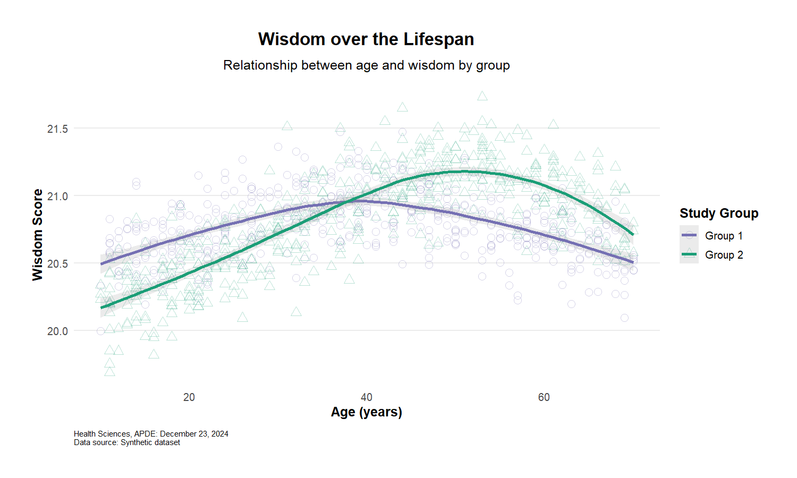
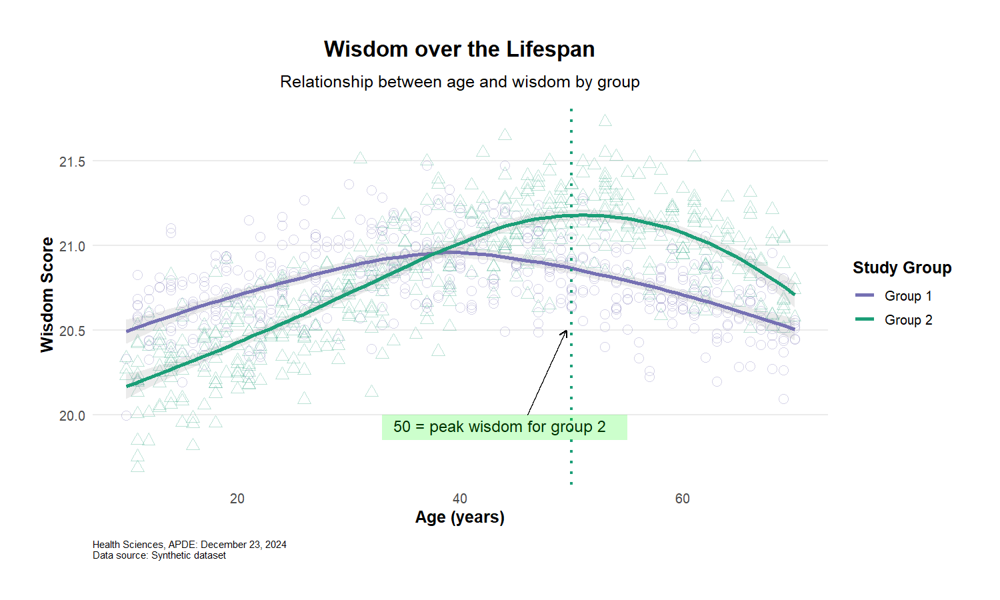

# Scatter Plots


This is a step-by-step guide to building a scatter plot with `ggplot2`.
While you would typically write all components in a single code block
using `+` to connect elements, we hope splitting the code will
illustrate how each snippet contributes to the final visualization.

## Load libraries

``` r
library(ggplot2)
library(data.table)
library(apde.graphs)
```

## Import & preview synthetic data

``` r
dt <- apde.graphs::wisdomDT
head(dt)
```

| age | group   | wisdom_score |
|----:|:--------|-------------:|
|  39 | Group 2 |     20.72610 |
|  69 | Group 2 |     20.68507 |
|  37 | Group 2 |     20.56191 |
|  40 | Group 1 |     20.63188 |
|  16 | Group 2 |     20.31905 |
|  21 | Group 1 |     20.61525 |

## Create the base `ggplot2` scatter plot

``` r
myplot <- ggplot(dt, aes(x = age,
                         y = wisdom_score,
                         color = group,    # different color for each group
                         shape = group)) + # different shape for each group
  
  # Basic scatter plot
  geom_point(alpha = 0.3,  # Transparency of dots (0 == most, 1 == least)
             size = 3) +   # dot size
  
  # Add smoothed fit lines with confidence intervals
  geom_smooth(method = 'loess',    # LOESS for non-linear trends, can also use 'lm' or 'glm'
              se = TRUE,           # Show CI
              alpha = 0.2,         # Transparency of CI (0 == most, 1 == least)
              linewidth = 1.2)     # Line thickness
```



## Define scales (colors and shapes)

``` r
myplot <- myplot +
  # Custom colors: can use names ('black') or hex ('#000000')
  scale_color_manual(values = c('Group 1' = '#7570B3',  
                                'Group 2' = '#1B9E77')) +
  
  # Custom dot shapes: options are 1:25
  scale_shape_manual(values = c('Group 1' = 1,  # 1 is hollow circle
                                'Group 2' = 2)) # 2 is hollow triangle
```



## Add labels

``` r
myplot <- myplot +
  labs(
    title = 'Wisdom over the Lifespan',
    subtitle = 'Relationship between age and wisdom by group',
    x = 'Age (years)',
    y = 'Wisdom Score',
    color = 'Study Group', # title for the color legend
    shape = 'Study Group'  # title for the shape legend
  )
```



## Add APDE customizations

The `apde_caption()` and `theme_apde()` elements are from the
`apde.graphs` package, not `ggplot2`.

``` r
myplot <- myplot +
  
  apde_caption(data_source = 'Synthetic dataset') +
  
  theme_apde()
```



## Add legend transparency

``` r
myplot <- myplot +
  guides(shape = guide_legend(
    override.aes = list(alpha = 0) # legend background transparency (0 == most, 1 == least)
    ))
```


## Add vertical reference line

``` r
myplot <- myplot +
  # use geom_hline for horizontal lines
  geom_vline(xintercept = 50,
             linetype = 'dotted', # also 'solid', 'dashed', 'dotdash', 'longdash', and 'twodash'
             linewidth = 1,
             color = '#1B9E77')
```


## Add annotations

``` r
myplot <- myplot +

  # annotate a specific point with text
  annotate(
    geom = 'text', 
    size = 4,
    x = 34, y = 19.9, # set coordinates based on the scale in your graphic
    label = '50 = peak wisdom for group 2',
    hjust = 0,    # horizontal justification
    vjust = 0) +  # vertical justification
  
  # point to something with an arrow
  annotate(
    geom = "segment", 
    x = 46, xend = 49.5,
    y = 20, yend = 20.5,
    arrow = arrow(length = unit(0.2, "cm"))) +
  
  # highlight a rectangle
  annotate(
    geom = 'rect', # highlight an area of your graph
    xmin = 33, xmax = 55,
    ymin = 19.85, ymax = 20,
    alpha = 0.2,    # transparency of rectangle (0 == most, 1 == least)
    fill = 'green', # color of rectangle
    col = NA)       # color of outline, NA == no outline
```



## Save the plot

`ggsave` automatically detects file type from filename extension (.jpg,
.png, .pdf, etc.)

``` r
ggsave(filename = 'wisdom_age_plot.jpg', 
       plot = myplot, 
       width = 10, 
       height = 6, 
       dpi = 600, 
       units = 'in') # also 'cm', 'mm', 'px'
```

– *Updated by dcolombara, 2024-12-23*
