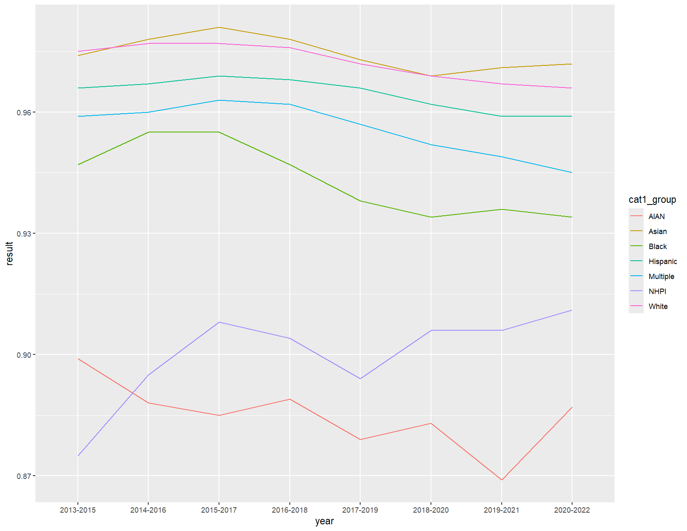
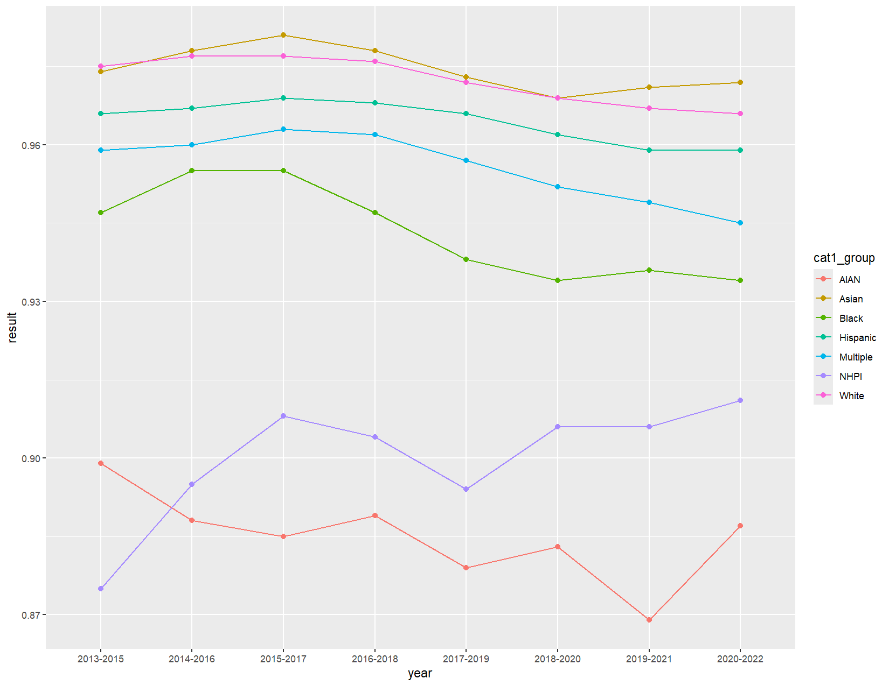
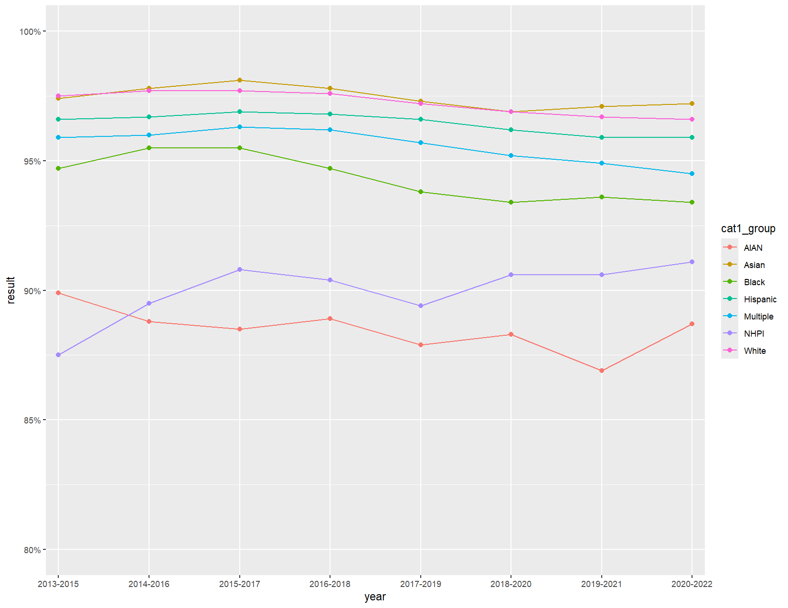
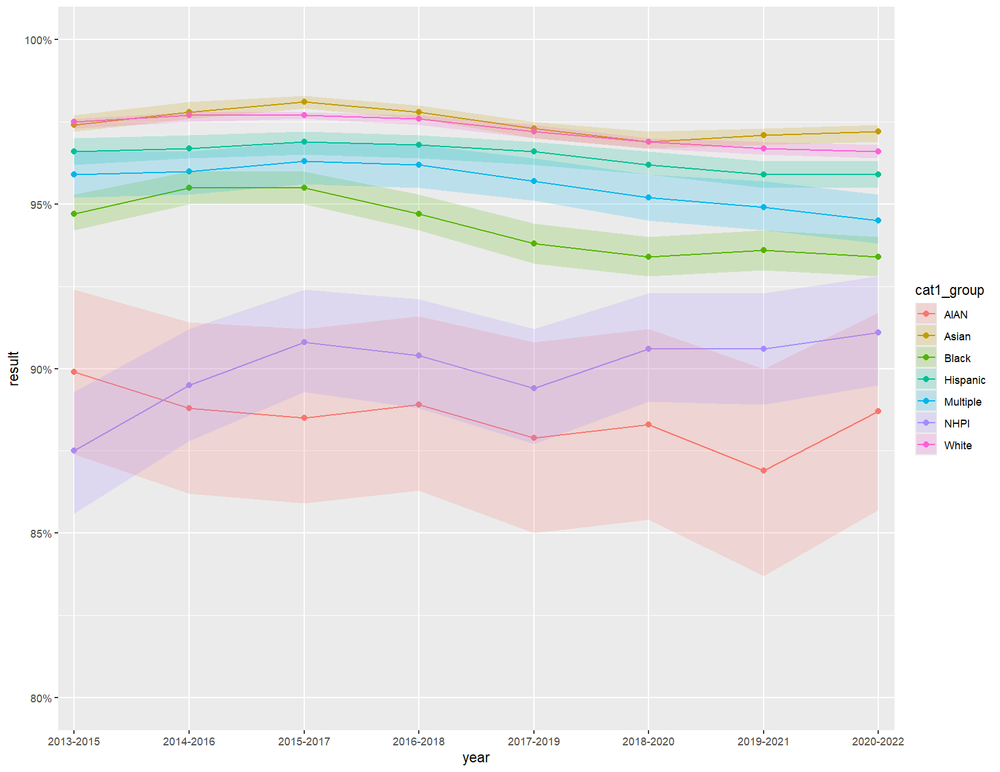
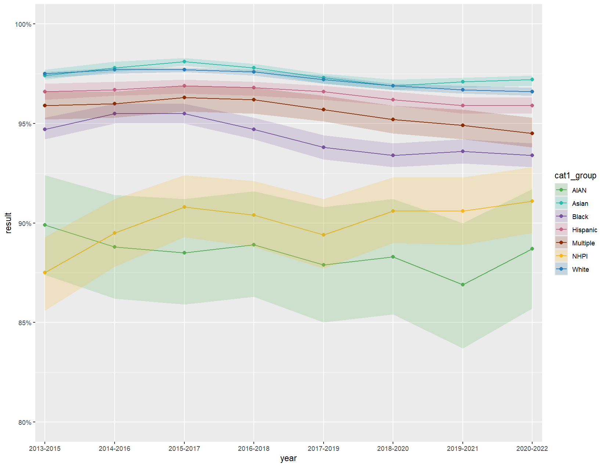
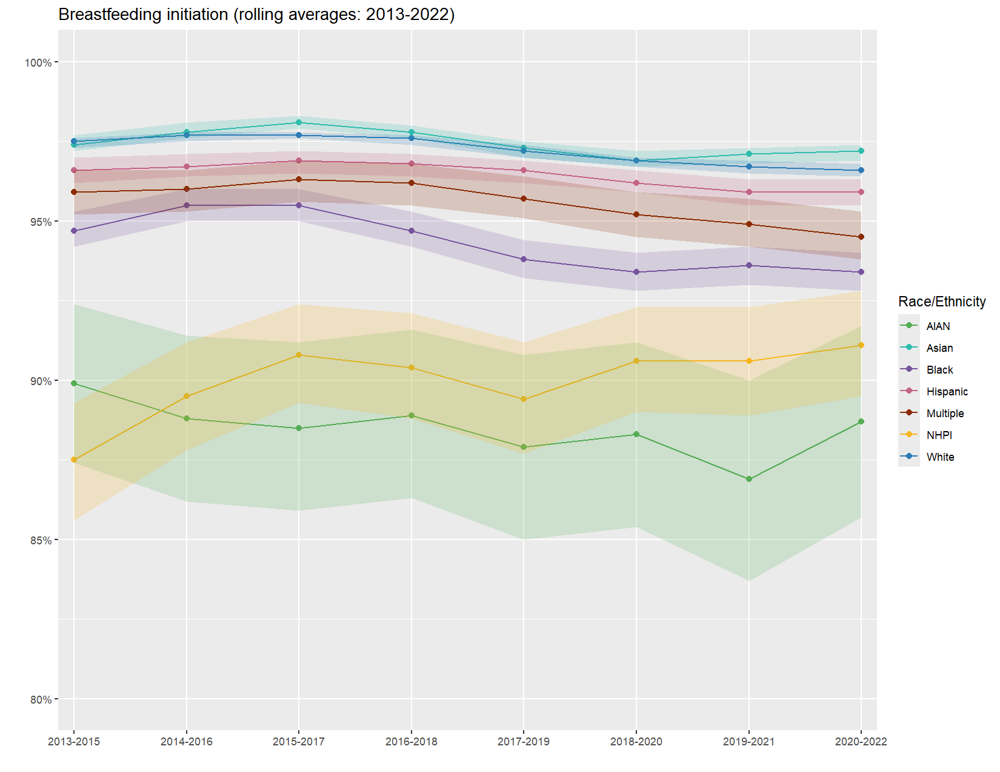
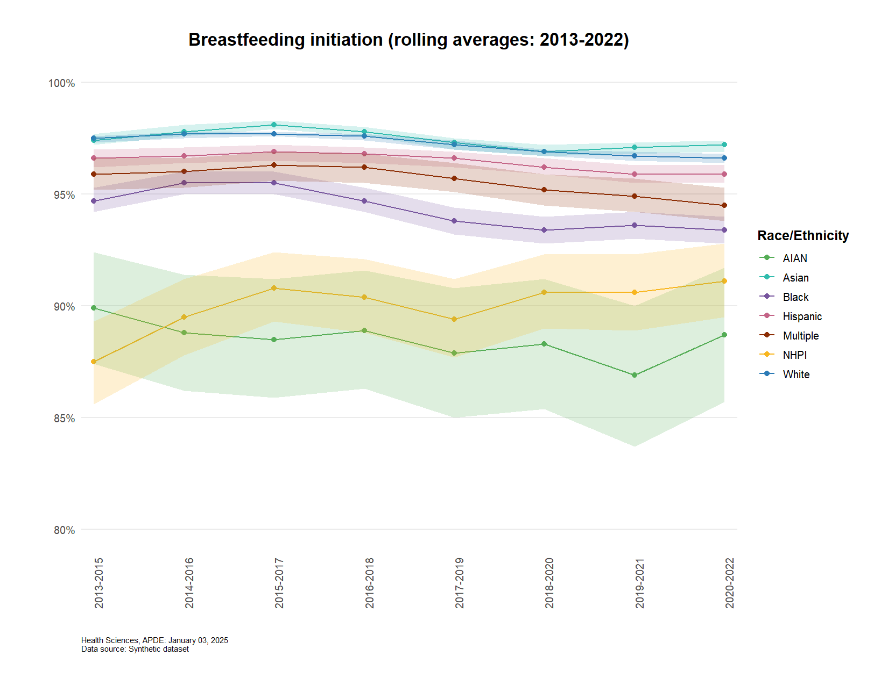
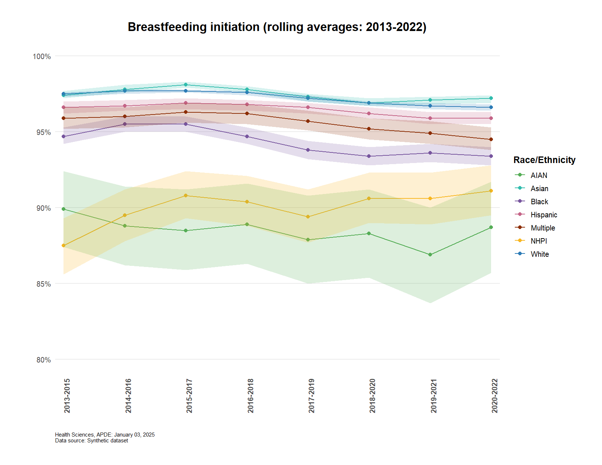

# Race/Ethnicity Trend Lines with Confidence Intervals


This is a step-by-step guide to building a
[CHI](https://kingcounty.gov/chi) style trend line graph using
`ggplot2`. While you would typically write all components in a single
code block using `+` to connect elements, we hope splitting the code
will illustrate how each snippet contributes to the final visualization.

## Load libraries

``` r
library(ggplot2)
library(data.table)
library(apde.graphs)
```

## Import & preview data

The breastfedDT dataset is a semi-synthetic dataset included in the
apde.graphs package for demonstration purposes.

``` r
dt <- apde.graphs::breastfedDT
dt <- dt[tab == 'trends' & cat1 == 'Race/ethnicity']
head(dt)
```

| tab | indicator_key | year | cat1 | cat1_group | cat1_varname | result | lower_bound | upper_bound | significance | caution | suppression |
|:---|:---|:---|:---|:---|:---|---:|---:|---:|:---|:---|:---|
| trends | breastfed | 2020-2022 | Race/ethnicity | AIAN | race3 | 0.887 | 0.857 | 0.917 | \* | ! | NA |
| trends | breastfed | 2020-2022 | Race/ethnicity | Asian | race3 | 0.972 | 0.969 | 0.974 | \* | NA | NA |
| trends | breastfed | 2020-2022 | Race/ethnicity | Black | race3 | 0.934 | 0.928 | 0.940 | \* | NA | NA |
| trends | breastfed | 2020-2022 | Race/ethnicity | Hispanic | race3 | 0.959 | 0.955 | 0.963 | NA | NA | NA |
| trends | breastfed | 2020-2022 | Race/ethnicity | Multiple | race3 | 0.945 | 0.938 | 0.953 | \* | NA | NA |
| trends | breastfed | 2020-2022 | Race/ethnicity | NHPI | race3 | 0.911 | 0.895 | 0.928 | \* | NA | NA |

## Create initial line plot

Start with basic trend lines for each racial/ethnic group.

``` r
myplot <- ggplot(dt,
                 aes(x = year,
                     y = result,
                     color = cat1_group,
                     group = cat1_group)) +
  geom_line()
```



## Add points for data values

Add points to show exact data values along the trend lines.

``` r
myplot <- myplot +
  geom_point(size = 2)
```



## Format axes

Format y-axis as percentage and adjust axis labels. This will zoom into
the relevant range of data. For true CHI standards, set
`limits = c(0, 1)` and `breaks = seq(0, 1, 0.1)`.

``` r
myplot <- myplot +
  scale_y_continuous(labels = scales::percent, # convert decimals to percentages
                    limits = c(0.8, 1), # Limit to 80-100% for better visibility of differences
                    breaks = seq(0.8, 1, 0.05)) + # 5 percentage point y-axis labels
  scale_x_discrete(expand = expansion(mult = 0.02))  # Add 2% padding to each side of x-axis limits
```



## Add confidence intervals

Add semi-transparent confidence interval ribbons.

``` r
myplot <- myplot +
  geom_ribbon(aes(ymin = lower_bound,
                  ymax = upper_bound,
                  fill = cat1_group),
              alpha = 0.2,    # Set transparency
              color = NA)     # No ribbon border
```



## Custom color scheme

Define specific colors for each category using hex codes or named
colors. These are based on APDE’s [Tableau Style
Guide](https://kc1.sharepoint.com/:w:/r/teams/DPH-TableauResources/_layouts/15/Doc.aspx?sourcedoc=%7B359811A5-92B0-4B13-B6DC-DD71CDBBA11B%7D&file=Tableau%20Style%20Guide%20v1.0.4.docx&action=default&mobileredirect=true)

``` r
# Define color palette
race_colors <- c(
  "AIAN" = "#55AD56",      
  "Asian" = "#30BCAD",      
  "Black" = "#77559E",      
  "Hispanic" = "#C46487",   
  "Multiple" = "#8C2D04",   
  "NHPI" = "#F8B620",       
  "White" = "#2C7bb6"       
)

myplot <- myplot +
  scale_color_manual(values = race_colors) + # set colors for lines and dots
  scale_fill_manual(values = race_colors)    # set same colors for ribbons (confidence intervals)
```



## Add titles and format legend

Add title and adjust legend position and labels.

``` r
myplot <- myplot +
  labs(title = "Breastfeeding initiation (rolling averages: 2013-2022)",
       x = "", # no x-axis title
       y = "", # no y-axis title
       color = "Race/Ethnicity") + # legend title
  guides(fill = "none")  # hide ribbon legend (redundant with line colors)
```



## Default APDE theme and formatting

The `apde_caption()`, `apde_theme()`, and `apde_rotate_xlab()` elements
are from the `apde.graphs` package, not `ggplot2`.

``` r
myplot <- myplot +
  apde_theme() +
  apde_caption(data_source = "Synthetic dataset") +
  apde_rotate_xlab(angle = 90, hjust = 1) # rotate x-axis labels 90 degrees
```



## Tweak default theme

Bold the x-axis labels to align with CHI standards.

``` r
myplot <- myplot +
  theme(axis.text.x = element_text(face = 'bold'))
```



## Save the plot

``` r
ggsave('race_ethnicity_trends.jpg',
       myplot,
       width = 11,
       height = 8.5,
       dpi = 600,
       units = 'in')
```
